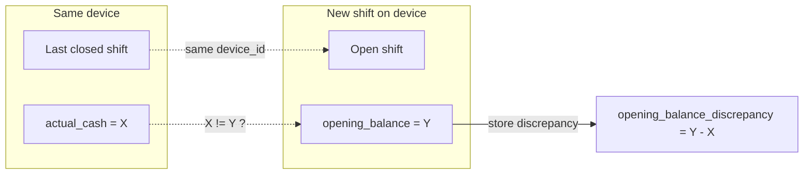

# Shift device_id and Opening Balance Discrepancy (Updated)

## Clarification

**Previous shift is determined by device_id:** When a shift is about to be opened on a device, the system checks the **last closed shift on that same device** (not the last closed shift in the branch). The opening balance declared for the new shift is compared to the `actual_cash` (declared at close) of that previous shift on the same device.

## 1. Database changes

**New migration** (e.g. `add_device_id_and_opening_balance_discrepancy_to_sales_shifts_table`):

- **sales_shifts.device_id** – `string(50)` nullable, after `user_id`. Store the device identifier (e.g. from request body or `X-Device-Id` header). Add index on `device_id` for lookups.
- **sales_shifts.opening_balance_discrepancy** – `decimal(15,2)` nullable. Value = this shift’s `opening_balance` minus the **previous closed shift on the same device**’s `actual_cash`. Null when there is no previous closed shift for this device or no comparison.
- **sales_shifts.previous_shift_id** – `foreignId` nullable, references `sales_shifts.id`, `onDelete('set null')`. The closed shift on the same device that was used for the comparison.

## 2. Model: [app/Models/SalesShift.php](app/Models/SalesShift.php)

- Add to **$fillable:** `device_id`, `opening_balance_discrepancy`, `previous_shift_id`.
- Add to **$casts:** `opening_balance_discrepancy` => `'decimal:2'`.
- Add relationship: **previousShift()** – `belongsTo(SalesShift::class, 'previous_shift_id')`.
- Optional helper: **hasOpeningBalanceDiscrepancy(): bool** – true when `opening_balance_discrepancy !== null && abs(opening_balance_discrepancy) >= 0.01`.

## 3. Open shift: [app/Http/Controllers/Api/SalesShiftController.php](app/Http/Controllers/Api/SalesShiftController.php) `store()`

- **Request:** **device_id is required** when creating a shift. Accept in body or from header `X-Device-Id` (body takes precedence if both present). Validation: require a non-empty device_id (e.g. merge header into request before validation, then `'device_id' => 'required|string|max:50'`).
- **Create shift:** Set `device_id` on the new shift from request or header.
- **After create – previous shift by device:**  

Find the **last closed shift with the same device_id**:

`SalesShift::forBusiness($businessId)->where('device_id', $newShift->device_id)->where('status', 'closed')->orderByDesc('end_time')->orderByDesc('id')->where('id', '!=', $newShift->id)->first()`.

If found and that shift has `actual_cash` not null, compute

`opening_balance_discrepancy = (float) $newShift->opening_balance - (float) $previousShift->actual_cash`.

If `abs($opening_balance_discrepancy) >= 0.01`, update the new shift: set `opening_balance_discrepancy` and `previous_shift_id`.

Because `device_id` is required, the comparison always runs when opening a shift.

## 4. API responses and filter

- **List/show:** Include `device_id`, `opening_balance_discrepancy`, and `previous_shift_id` (or minimal `previous_shift` object) in shift payloads (e.g. in `enrichShiftWithStats()`).
- **Filter:** In `index()`, allow filtering by `device_id` when provided.

## 5. Summary

- **Previous shift** = most recent **closed** shift with the **same device_id** (same device). Branch is not used for this lookup.
- **Opening balance discrepancy** = new shift’s `opening_balance` minus that previous shift’s `actual_cash`, stored when a comparable previous closed shift exists for that device. **device_id is required** when creating a shift.